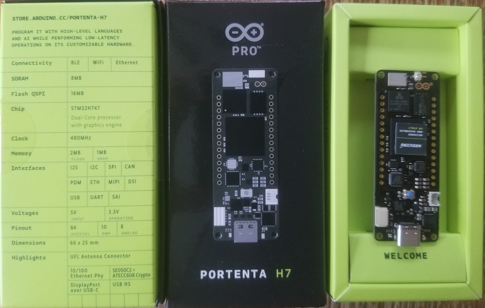

## my-examples-for-the-arduino-portentaH7
My examples for the new Arduino Pro board the Portenta H7

The playlist of all my Portenta Videos and other interesting videos at (Note: as of Aug 11, 2020 I havn't made any videos yet, just trying to get all the code working) 

[https://www.youtube.com/playlist?list=PL57Dnr1H_egtm0pi-okmG0iE_X5dROaLw](https://www.youtube.com/playlist?list=PL57Dnr1H_egtm0pi-okmG0iE_X5dROaLw)

#### Please subscribe to my youtube channel as I am just below the 1000 needed subscribers.

As of July 24th, 2020 this site is just to get the PortentaH7 working how I like it to work. 

My Arduino Robotics teaching will eventually contain student tested Arduino teaching programs with instructional videos. 

https://github.com/hpssjellis/arduino-high-school-robotics-course  

#### Use at your own risk
#### By Jeremy Ellis
#### Twitter https://twitter.com/rocksetta
#### Website https://www.rocksetta.com/
#### [My Portenta Youtube Playlist](https://www.youtube.com/playlist?list=PL57Dnr1H_egtm0pi-okmG0iE_X5dROaLw)

So Far what is working:

0. [my00-dual-clean.ino](my00-dual-clean.ino) As the M7 core loads itself and using bootM4() the M4 core, what if one of them has a problem and you are working on the other one? Sometimes you need to clean both cores before you can upload new code to both cores. Or at least clean the other code before uploading new code. 

1. [my01-BlinkM7.ino](my01-BlinkM7.ino) Get the Portenta H7 Blinking with it's weird on board LED's connected to 3V3 so you have to send LOW to turn it on. Great for the board health (can't send 5V to it and break the LED), but crappy for anyone use to HIGH turns LED's on.

2. "A" [my02a-dual-core.ino](my02-dual-core.ino) Proud of this. I have taken the Pro Tutorial and made it more smooth. This code can be flashed to either core and randomly sets blue and green onboard LED flashing. This is the way to write dual core code.  Pro Tutorial at  https://www.arduino.cc/pro/hardware/product/portenta-h7 then go to there tutorials

2. "B" [my02b-dual-core-RPC.ino](my02-dual-core-RPC.ino) An advanced program.  The M4 core cannot print to Serial, so this advanced example uses RPC (Remote Procedure Call) to send a print command from the M4 core to the M7 core to print to serial. Note: You must change a compiler directive for the M4 core, add -fexceptions to the cflags.txt and cxxflags.txt files in the board location  AppData\Local\Arduino15\packages\arduino-beta\hardware\mbed\1.2.2\variants\PORTENTA_H7_M4

2. "C" [my02c-dual-core-RPC-variable.ino](my02c-dual-core-RPC-variable.ino) Another advanced file that I would leave until you are more comfortable with the Portenta

2. "D" [my02d-dual-core-RPC-timer.ino](my02d-dual-core-RPC-timer.ino) Another advanced file that I would leave until you are more comfortable with the Portenta this one uses and interval instead of the delay.

3. [my03-BLE-LED-control.ino](my03-BLE-LED-control.ino) All this does is activate the onboard LED using BLE. I use the nrf-connect androd app, but any BlueTooth connectivity app should be able to turn on and off your LED.

4. [my04-BLE-LED-multi-control.ino](my04-BLE-LED-multi-control.ino) Proud of this baby. It scand for BLE LED activated boards that must have "LED" in their bluetooth set local name and then one after another flashes the on board LED. The boards even work when fully disconnected from a computer (use a usb stick to power the boards). Unfortunately to test this out you need more than one board. I have a few Nano 33 IOT boards that have  my03-BLE-LED-control.ino running powered by a wall charger.

5. [my05-Web-server.ino](my05-Web-server.ino) Cool webserver with buttons to control the on-board LED. Needs to show the serial monitor to discover the local IP address. You must be on the same local network to view the page. More complex to make as a full www webpage. Strangely needs to be connected to a computers USB port, that should not be an issue.

6. [my06_LED_onboard_setRGB.ino](my06_LED_onboard_setRGB.ino) a fairly advanced program that allows complete control of the on-board LED's.

7. [my07-analog-test.ino](my07-analog-test.ino) Jusat a program that quicly prints out all the analogRead pins A0-A6

8. [my08-mbed-blink.ino](my08-mbed-blink.ino)   starting to use the mbed compiler, fairly different from arduino code.

9. [my09-tensorflow-machine-learning-link.md](my09-tensorflow-machine-learning-link.md) This is still kind of flakey. Read my opinions in that folder. I did get the TensorflowLite Hello_world working on the serial-plotter

10. [my10-DAC-to-ADC.ino](my10-DAC-to-ADC.ino) Testing the DAC pin at A6 as it sends from 0.0 to 1.0 to both A0 for analogRead (from 0 to 1023) and D6 for digitalRead (from 0 to 1). 

11. [my11-servo.ino](my11-servo.ino) Basic servo functionality. Will need Servo.h greater than 0.0.2 or make the changes stated [here](https://forum.arduino.cc/index.php?topic=691668.msg4700186#msg4700186) on the Arduino forum.

12. [my12-serial1-crash.ino](my12-serial1-crash.ino). The portenta sends crash information through the Serial1 RX and TX pins. This program allows you to load a serial1 monitoring programon another 3.3V arduino (Note: must use protective resistors if using an older 5V arduino). The easier approach is to connect a TTL USB cable to Gnd, RX and TX but I don't have one of those cables.

## Portenta H7 Pinout documentation:
Lots more info in this pdf file: https://content.arduino.cc/assets/Pinout-PortentaH7_latest.pdf

.

## Other sites with good examples about Portenta

https://github.com/trimchess/portenta_basics

