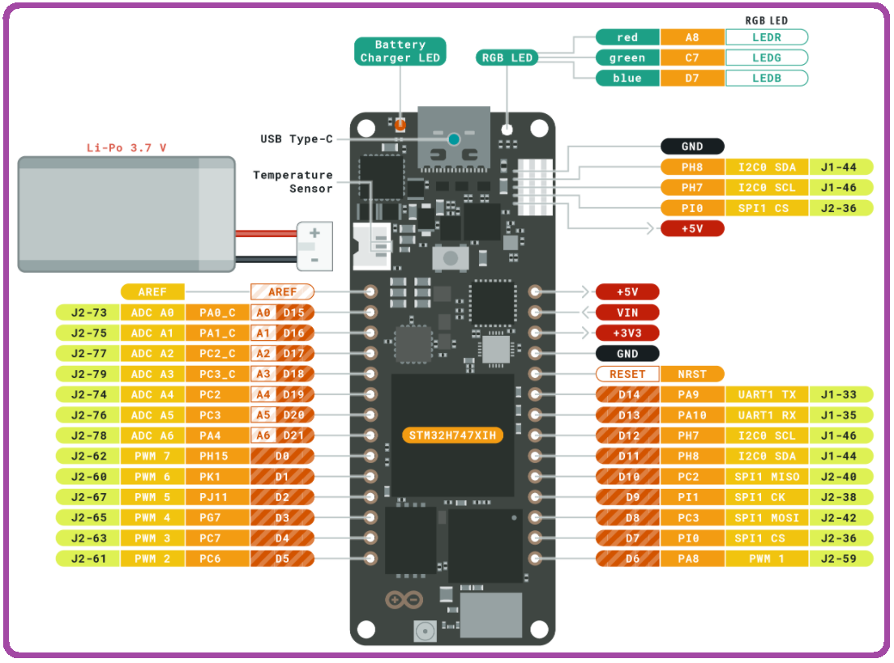

## my-examples-for-the-arduino-portentaH7
My examples for the new Arduino Pro board the Portenta H7

## My New Arduino Library 
Based on these examples and other demos
https://github.com/hpssjellis/portenta-pro-community-solutions


## Main Site
Main Teaching Site that will use this information [https://github.com/hpssjellis/maker100](https://github.com/hpssjellis/maker100)

## main Library for the Portenta [here](https://github.com/hpssjellis/portenta-pro-community-solutions)


## Oct 4th, 2020

I just tested ~19 of these programs and put my results at [research/README.md](research/README.md) I fixed a few mistakes and got DAC working. The reason I tested everything is there is a new version of the mbed board software for the PortentaH7 coming out soon.


## Portenta Basic Pinout




Portenta Schematic [here](https://content.arduino.cc/assets/Arduino-PortentaH7-schematic-V1.0.pdf)

Portenta full Datasheet pdf [here](https://content.arduino.cc/assets/Pinout-PortentaH7_latest.pdf)

Arduino MBED core github  https://github.com/arduino/ArduinoCore-mbed


STM32H747XIH6  https://www.st.com/en/microcontrollers-microprocessors/stm32h747xi.html#11  

STM32H747XIH6   datasheet https://www.st.com/resource/en/datasheet/stm32h747xi.pdf  

 STM32H747XIH6    video https://www.st.com/en/microcontrollers-microprocessors/stm32h747xi.html#


# The growing playlist of all my Portenta Videos is now live at

[https://www.youtube.com/playlist?list=PL57Dnr1H_egtm0pi-okmG0iE_X5dROaLw](https://www.youtube.com/playlist?list=PL57Dnr1H_egtm0pi-okmG0iE_X5dROaLw)

Click image below to view the same playlist link as above

[](https://www.youtube.com/playlist?list=PL57Dnr1H_egtm0pi-okmG0iE_X5dROaLw)


#### Please subscribe to my youtube channel and send the link to other Robotics enthusiasts as I am just below the 1000 needed subscribers to make any income.

Note: The Arduino Pro site has much more professional Pro tutroials at https://www.arduino.cc/pro/tutorials/portenta-h7 that lead you through every step of similar examples, however these videos are for people just to quickly get up and running.


As of July 24th, 2020 this site is just to get the PortentaH7 working how I like it to work. 

My Arduino Robotics teaching will eventually contain student tested Arduino teaching programs with instructional videos. 

https://github.com/hpssjellis/arduino-high-school-robotics-course  


#### Use at your own risk
#### By Jeremy Ellis
#### Twitter https://twitter.com/rocksetta
#### Website https://www.rocksetta.com/
#### [My Portenta Youtube Playlist](https://www.youtube.com/playlist?list=PL57Dnr1H_egtm0pi-okmG0iE_X5dROaLw)


So Far what is working:

#### 0
[my00-dual-clean.ino](my00-dual-clean.ino) As the M7 core loads itself and using bootM4() the M4 core, what if one of them has a problem and you are working on the other one? Sometimes you need to clean both cores before you can upload new code to both cores. Or at least clean the other code before uploading new code. [Clean video at here](https://www.youtube.com/watch?v=EDc_UKpkyfc&list=PL57Dnr1H_egtm0pi-okmG0iE_X5dROaLw&index=3&t=0s)


#### 1
[my01-BlinkM7.ino](my01-BlinkM7.ino) Get the Portenta H7 Blinking with it's weird on board LED's connected to 3V3 so you have to send LOW to turn it on. Great for the board health (can't send 5V to it and break the LED), but crappy for anyone use to HIGH turns LED's on. 

#### 1b
[my01b-blink-serial.ino](my01b-blink-serial.ino). Always good to test both blink and serial. This code sets M7 to boot M4 as well. If issues make sure M4 is clean. [Blink Serial video here](https://www.youtube.com/watch?v=ZH355owXveo&list=PL57Dnr1H_egtm0pi-okmG0iE_X5dROaLw&index=4&t=0s)


#### 2
[my02a-dual-core.ino](my02a-dual-core.ino) Proud of this. I have taken the Pro Tutorial and made it more smooth. This code can be flashed to either core and randomly sets blue and green onboard LED flashing. This is the way to write dual core code.  Pro Tutorial at  https://www.arduino.cc/pro/hardware/product/portenta-h7 then go to the tutorials


### note: the my02 group after the first one is farily advanced, best to skip to my03
 The changes were that for RPC you need to add -fexceptions to the cflags.txt and cxxflags.txt files in the board location  AppData\Local\Arduino15\packages\arduino-beta\hardware\mbed\1.2.2\variants\PORTENTA_H7_M4 I have put in a request to have it changed [here](https://github.com/arduino/ArduinoCore-mbed/issues/55) to the ArduinoCore-mbed

#### 2b  deprecated!
[my02b-dual-core-RPC.ino](my02b-dual-core-RPC.ino) An advanced program.  The M4 core cannot print to Serial, so this advanced example uses RPC (Remote Procedure Call) to send a print command from the M4 core to the M7 core to print to serial. 

#### 2c   deprecated!
[my02c-dual-core-RPC-variable.ino](my02c-dual-core-RPC-variable.ino) Another advanced file that I would leave until you are more comfortable with the Portenta

#### 2d  deprecated!
[my02d-dual-core-RPC-timer.ino](my02d-dual-core-RPC-timer.ino) Another advanced file that I would leave until you are more comfortable with the Portenta this one uses and interval instead of the delay.


#### 2e  deprecated!
[my02e-easier-dual.ino](my02e-easier-dual.ino) Easier Dual RPC programming that fully seperates the M4 and M7 core programs but still in one file. A very small delay added to the M7 core while the M4 core has a long delay to slow things donw enough to see what is happening. Means more code to write, but much easier to understand and to build from.

#### 2f  deprecated!
[my02f_easy_m4_rpc_print.ino](my02f_easy_m4_rpc_print.ino) This is my new favorite RPC. It redirects regular Serial.println from the M4 core to the M7 as regular Serial.println, by using ``` #define Serial RPC1  ``` but only for the M4 core.

#### 2g  deprecated!
[my02g-analogRead-m4-rpc.ino](my02g-analogRead-m4-rpc.ino). Showing how to do analogRead of A0 to A6 but on the M4 core. Also found that delayMicrosecond(1234); was needed between each Serial.println(); statement for RPC to fully work. 

#### 2h  deprecated!
[my02h-rpc-from-m4.ino](my02h-rpc-from-m4.ino). Some people have been having troubles with complex varriable passing on the Arduino forum at  https://forum.arduino.cc/t/passing-variable-from-cm7-to-cm4-using-rpc/692026/4  this program just shows that the variable can be on the M4 core and use RPC to be controlled by the M7 core. It also shows storing more than one variable. The issues on the forum are using much more complex systems so not sure if this will be helpfull.


### Note: End advanced RPC stuff that requires a few changes to your library
 The changes were add -fexceptions to the cflags.txt and cxxflags.txt files in the board location  AppData\Local\Arduino15\packages\arduino-beta\hardware\mbed\1.2.2\variants\PORTENTA_H7_M4

#### 3
[my03-BLE-LED-control.ino](my03-BLE-LED-control.ino) All this does is activate the onboard LED using BLE. I use the nrf-connect androd app, but any BlueTooth connectivity app should be able to turn on and off your LED. [BLE video here](https://www.youtube.com/watch?v=K96uz8Dp20w&list=PL57Dnr1H_egtm0pi-okmG0iE_X5dROaLw&index=11), This Arduino Tutorial is based on my BLE program (Look for my name at the bottom of the page ) [Pro BLE Tutorial here](https://www.arduino.cc/pro/tutorials/portenta-h7/por-ard-ble)

#### 4
[my04-BLE-LED-multi-control.ino](my04-BLE-LED-multi-control.ino) Proud of this baby. It scans for BLE LED activated boards that must have "LED" in their bluetooth set local name and then one after another flashes the on board LED. The boards even work when fully disconnected from a computer (use a usb stick to power the boards). Unfortunately to test this out you need more than one board. I have a few Nano 33 IOT boards that have  my03-BLE-LED-control.ino running powered by a wall charger. [BLE multi video here](https://www.youtube.com/watch?v=_06vKjbj5gI&list=PL57Dnr1H_egtm0pi-okmG0iE_X5dROaLw&index=12)

#### 5
[my05-Web-server.ino](my05-Web-server.ino) Cool webserver with buttons to control the on-board LED. Needs to show the serial monitor to discover the local IP address. You must be on the same local network to view the page. More complex to make as a full www webpage. Strangely needs to be connected to a computers USB port, that should not be an issue.


#### 6
[my06_LED_onboard_setRGB.ino](my06_LED_onboard_setRGB.ino) a fairly advanced program that allows complete control of the on-board LED's.

#### 7
[my07-analog-test.ino](my07-analog-test.ino) Just a program that quickly prints out all the analogRead pins A0-A6

#### 8
[my08-mbed-blink.ino](my08-mbed-blink.ino)   starting to use the mbed compiler, fairly different from arduino code.

#### 9
[/m09-Tensoflow](m09-Tensoflow)  Read my opinions in that folder. I did get the TensorflowLite Hello_world working on the serial-plotter. Now I am able to convert my TensorflowJS Vanilla Javascript Machine Learning models to a C header file format for the Arduino. Check out this page. https://github.com/hpssjellis/my-examples-for-the-arduino-portentaH7/tree/master/m09-Tensoflow/tfjs-convert-to-arduino-header 


#### 10
[my10-DAC-to-ADC.ino](my10-DAC-to-ADC.ino) Testing the DAC pin at A6 as it sends from 0.0 to 1.0 to both A0 for analogRead (from 0 to 1023) and D6 for digitalRead (from 0 to 1).  [DAC To ADC video here](https://www.youtube.com/watch?v=9OrItMqI2VQ&list=PL57Dnr1H_egtm0pi-okmG0iE_X5dROaLw&index=19&t=0s)


#### 11
[my11-servo.ino](my11-servo.ino) Basic servo functionality. Will need Servo.h greater than 0.0.2 or make the changes stated [here](https://forum.arduino.cc/index.php?topic=691668.msg4700186#msg4700186) on the Arduino forum.

#### 12
[my12-serial1-crash.ino](my12-serial1-crash.ino). The portenta sends crash information through the Serial1 RX and TX pins. This program allows you to load a serial1 monitoring program on another 3.3V arduino so that crash info can go from that arduino through USB to your computer. (Note: must use protective resistors if using an older 5V arduino). The easier approach is to connect a TTL USB cable to Gnd, RX and TX but I don't have one of those cables.


#### 13
[my13_uart_m4_m7_print.ino](my13_uart_m4_m7_print.ino) Similar to the crash report that uses another arduino to catch the serial1 UART TX and TR and GND print output. This program allows UART print from either the M7 or M4 cores. Great for debugging the M4 core. Uses ``` _UART1_.println("Hi");``` which on the M7 is the same as Serial1.println("Hi"); and on the M4 core is Serial.println("hi"); The program also tests for Portenta or not and programs for each of 2 boards 3 cores.


#### 14
[my14_8x8_thermal_Array.ino](my14_8x8_thermal_Array.ino) Finally starting to make cool things. This $52 USD Thermal 8x8 array can sense who has a temperature. The program flashes the onboard LED when it senses a temperaturre change, but if the highest temperature is above a set threshold (I used 39 degrees celcius), it flashes continuously for about 20 seconds. The serial monitor is not needed but gives average array temperature and highest recorded temperature. Prints about 3 times until it settles down again. Uses the AMG8831 sensor at [AMG8833 IR 88 Thermal Imager Array Temperature Sensor Module 8x8 Infrared Camera Sensor](https://www.amazon.com/s?k=AMG8833+IR+88+Thermal+Imager+Array+Temperature+Sensor+Module+8x8+Infrared+Camera+Sensor&ref=nb_sb_noss) that is a generic search I used [this one](https://www.amazon.com/AMG8833-Thermal-Imager-Temperature-Infrared/dp/B07YZRGVB9/ref=sr_1_1?dchild=1&keywords=AMG8833+IR+8+*+8+Thermal+Imager+Array+Temperature+Sensor+Module+8x8+Infrared+Camera+Sensor&qid=1600007347&sr=8-1)


#### 15
[my15-TRACE32.ino](my15-TRACE32.ino)  Presently testing the TRACE32 debugger by [Lauterbach.com-download_demo.html ](https://www.lauterbach.com/frames.html?download_demo.html). And the [Lauterbach-license-request](https://www.lauterbach.com/frames.html?register_arduino.php) Video part2 [here](https://www.youtube.com/watch?v=cqmzTzhpGh0&list=PL57Dnr1H_egtm0pi-okmG0iE_X5dROaLw&index=36), as [Part1 is deprecated](https://www.youtube.com/watch?v=pboPKm5ZDOQ&list=PL57Dnr1H_egtm0pi-okmG0iE_X5dROaLw&index=35) if you have the new [ASM/system-settings.cmm](ASM/system-settings.cmm) file  The other my15 sketches were early attempts and will probably end up in the [old](old) folder. Note: As of Jan 2020, the inner M4 core does not work yet with TRACE32. Arduino needs to make some changes to the software.

#### 16
[my16-TRACE32-with-assembly-language.ino](my16-TRACE32-with-assembly-language.ino). The new version of Trace32 is ready Jan 11th, 2021. Video available soon, this file is the same as my15, just with some inline assembly code to show how to do some assembly directly in your Arduino code if needed. (Probably a really good idea to stay very far away from any assembly language.)  [New Part 3 TRACE32 video here](https://www.youtube.com/watch?v=_wZrgxLO-Wg&list=PL57Dnr1H_egtm0pi-okmG0iE_X5dROaLw&index=37)

### 17 
[my17-ThreadedTimer.ino](my17-ThreadedTimer.ino)  submitted by [Waleed El-Badry](https://github.com/wbadry) example of using potentially parallel timers using the ThreadedTimer library by [Auden](https://github.com/Aduen) at https://github.com/Aduen/ThreadedTimer Simply download the zipped library and add the library to the Arduino library add zipped file. " A single ThreadedTimer runs in its own Thread and multiple Threaded Timers can run parallel without delaying each other."


### 18 
[my18-mbed-thread.ino](my18-mbed-thread.ino) My version of mbed threading. Good stuff here.


### 19 
[my19-ethernet-webserver.ino](my19-ethernet-webserver.ino) Finally Ethernet working on both Linux and Windows. This should work for both the Etherrnet Vision Shield and the Breakout board.


### 20
[my20-aysnc-web-server.ino](my20-aysnc-web-server.ino) Cool async webserver by @khoih-prog edited by me. Uses his official arduino library  [Portenta_H7_AsyncWebServer](https://github.com/khoih-prog/Portenta_H7_AsyncWebServer)


## huge STM32h7 reference manual [here](https://www.st.com/resource/en/reference_manual/dm00176879-stm32h745755-and-stm32h747757-advanced-armbased-32bit-mcus-stmicroelectronics.pdf)


#### pinout

## Portenta H7 Pinout documentation:
Lots more info in this pdf file: https://content.arduino.cc/assets/Pinout-PortentaH7_latest.pdf


.


#### other

## Other sites with good examples about Portenta

https://github.com/trimchess/portenta_basics

https://www.arduino.cc/pro/tutorials/portenta-h7


#### links

The battery connector  https://www.digikey.com/product-detail/en/jst-sales-america-inc/BM03B-ACHSS-GAN-TF-LF-SN/455-2203-1-ND/1647795
