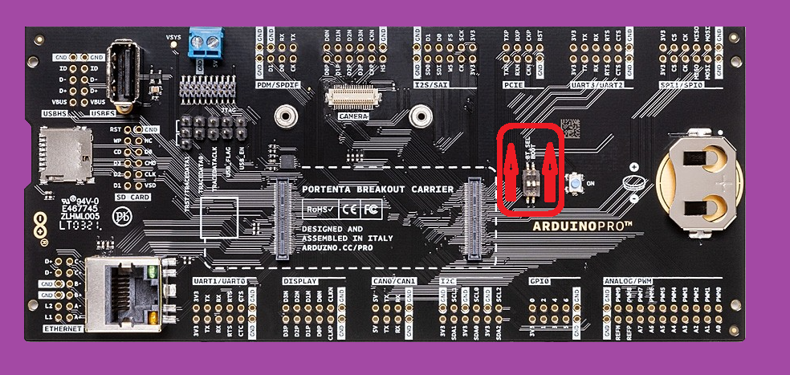

 // Testing the PWM pins
 
 Interesting data sheet here
 
 https://www.manualshelf.com/manual/arduino/abx00042/datasheet-english/page-4.html
 
 

Breakout board Schematic [here](https://content.arduino.cc/assets/Schematics-ASX00031.pdf)

Breakout Board Datasheet pdf [here](https://content.arduino.cc/assets/Datasheet-Portenta-Breakout-Board.pdf)

note: I am tryiing to make my own PCB boards with the HD connectors of the breakout board

Top would have 2 

DF40C-80DS-0.4V(51)

https://www.digikey.ca/en/products/detail/hirose-electric-co-ltd/DF40C-80DS-0-4V-51/1969493?s=N4IgTCBcDaICIDEAsAGAwgWgBwrgZQxQDokA1ACgFYBGAShAF0BfIA

and the bottom layer with 2 

DF40C-80DP-0.4V(51)

https://www.digikey.ca/en/products/detail/hirose-electric-co-ltd/DF40C-80DP-0-4V-51/1969492?s=N4IgTCBcDaICIDEAsAGAwgWgBwrgBQxQDokA1ACgFYBGAShAF0BfIA

Folllwing image from thew Arduino Store interactive viewer of the schematic

https://store-usa.arduino.cc/products/arduino-portenta-breakout?selectedStore=us

