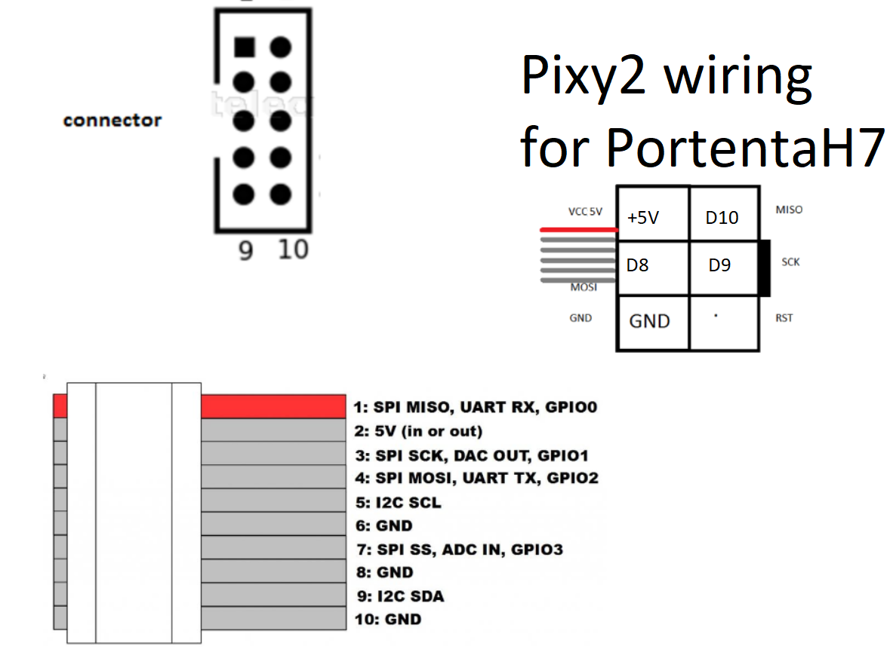
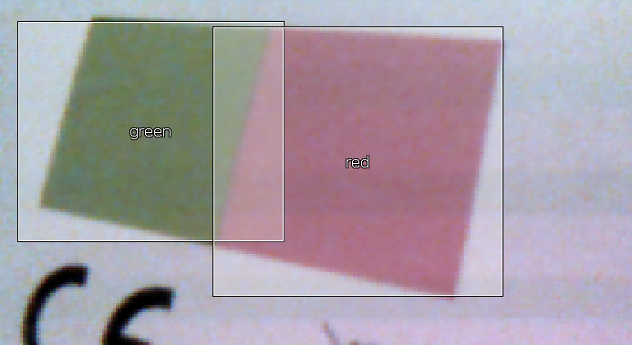

|This folder is for examples using the portenta with the pixy2 Charmed labs color detection webcam.

Note: The pixy library for the arduino does not work out of the box, you have to delete the last 4 files. this zipped file is a working Adruno library that needs to be unzipped and then put in your local libraries folder. (where all your other libraries are stored.)

I think SCK on the Portenta is CK

PortenaH7 --> Pixy2  
+5V --> VIN     
GND --> GND   
D10 --> MISO   
D9  --> SCK   
D8  --> MOSI   

First load [a01_ccc_pixy.ino](a01_ccc_pixy.ino) just to see if the Pixy2 is connected correctly. Bit confusing to program so best to use the pixymon program to visually program the pixy. https://pixycam.com/downloads-pixy2/ looking for pixymon V2

What the windows program that can see what the arduino sees.

Using the program [a02-pixy-data.ino](a02-pixy-data.ino) I am getting data kind of like:

[198,91],[87,105],[139,141],[157,58],[159,103],[207,72],[188,103],[162,78],[159,103],[182,103],  
[159,73],[159,103],[179,103],[181,103],[159,105],[232,103],[159,103],[159,103],[198,78],[159,103],  
[159,99],[232,103],[161,103],[159,103],[174,78],[159,103],[159,69],[157,42],[161,72],[157,103],  
[157,103],[158,103],[159,102],[158,103],[168,73],[60,72],[74,137],[309,4],[55,187],[51,186],  
[55,187],[51,188],[57,187],[55,187],[51,188],[56,188],[47,187],[51,187],[51,187],[51,188],  
[51,187],[55,189],[51,186],[47,187],[51,187],[51,189],[51,189],[51,189],[53,187],[51,188],  
[51,187],[47,186],[47,187],[47,188],[51,187],[33,180],[39,185],[51,189],[51,188],[36,183],  

The [a03-pixy-data-smoothed.ino](a03-pixy-data-smoothed.ino) file organizes the data a bit giving zeros first then waiting for movement then giving zeros when the movement has stopped. Pixy is very sensitive to room lighting. This was hard to get good data. Listed below is the fairly good data while I was drawing a zero in the air. Other letters will take longer to draw.
   
[0,0],[0,0],[117,105],[106,94],[127,92],[140,104],[134,109],[116,110],[102,93],[111,87],[124,95],[0,0],[0,0],[0,0],[0,0],[0,0],[0,0],[0,0],[0,0],[0,0],[0,0],  
[0,0],[0,0],[102,88],[101,78],[104,73],[115,76],[126,85],[124,94],[115,94],[110,91],[117,92],[0,0],[0,0],[0,0],[0,0],[0,0],[0,0],[0,0],[0,0],[0,0],[0,0],  
[0,0],[0,0],[101,87],[85,73],[94,69],[104,66],[112,74],[117,82],[113,88],[0,0],[0,0],[0,0],[0,0],[0,0],[0,0],[0,0],[0,0],[0,0],[0,0],[0,0],[0,0],  
[0,0],[0,0],[93,81],[76,66],[77,57],[91,57],[99,61],[109,70],[115,83],[117,90],[0,0],[0,0],[0,0],[0,0],[0,0],[0,0],[0,0],[0,0],[0,0],[0,0],[0,0],  
[0,0],[0,0],[100,90],[85,79],[82,63],[100,63],[118,76],[115,86],[110,88],[0,0],[0,0],[0,0],[0,0],[0,0],[0,0],[0,0],[0,0],[0,0],[0,0],[0,0],[0,0],  

